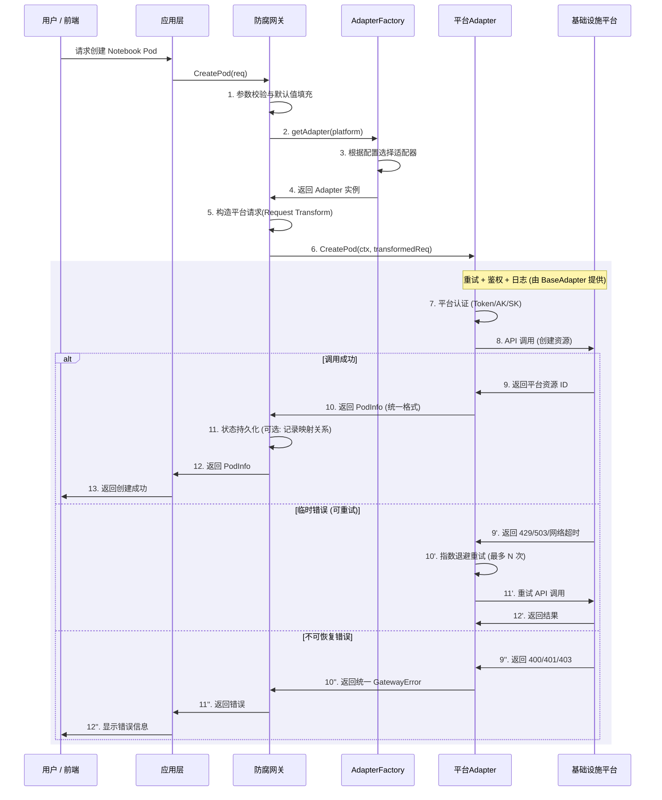
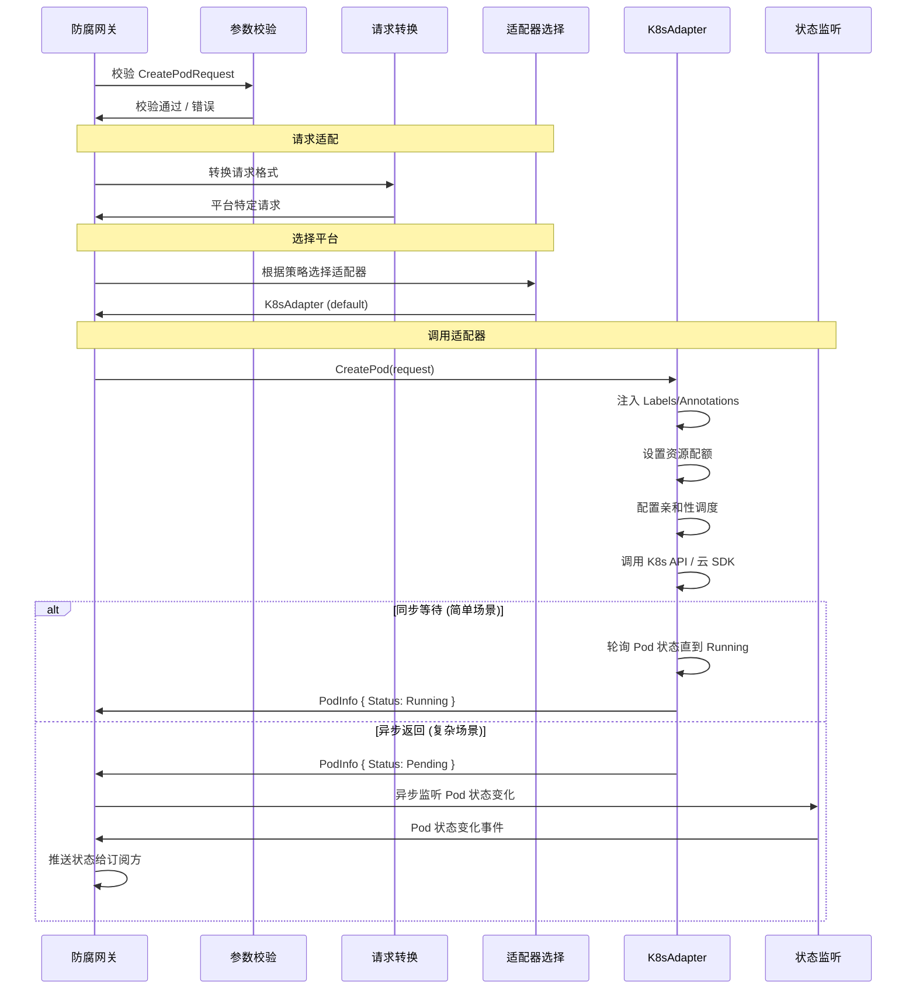
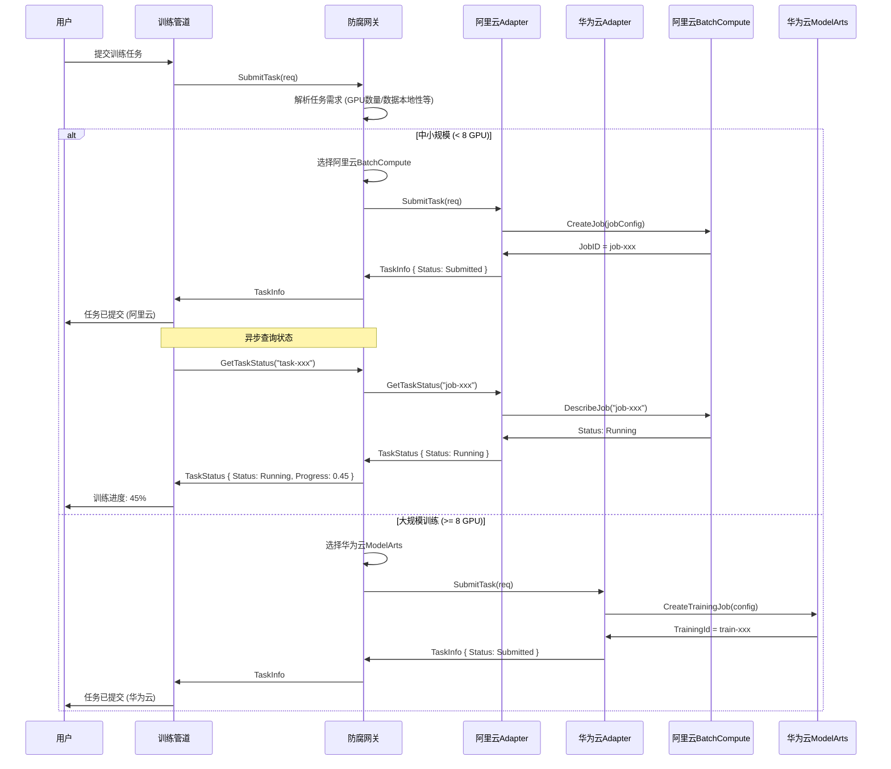
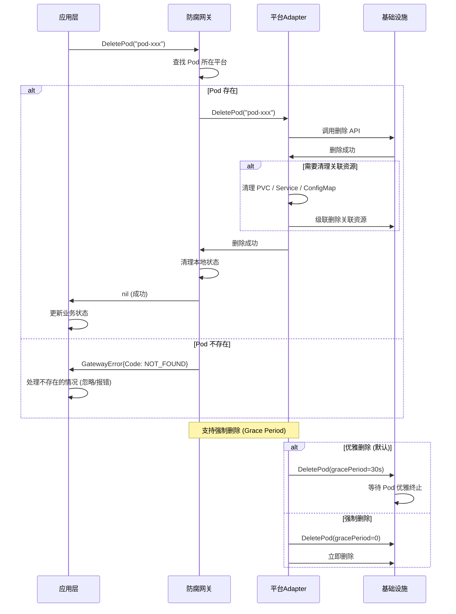
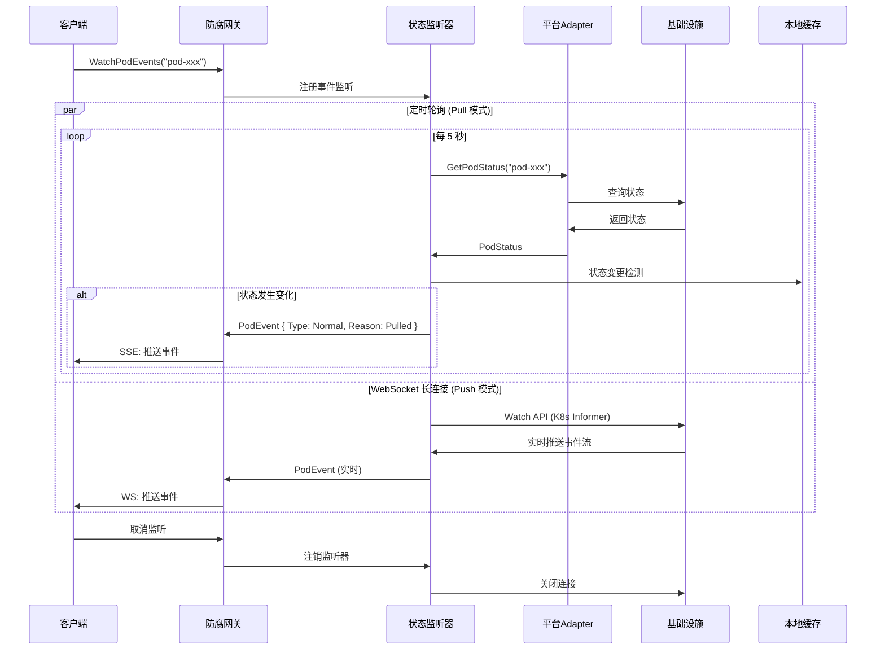
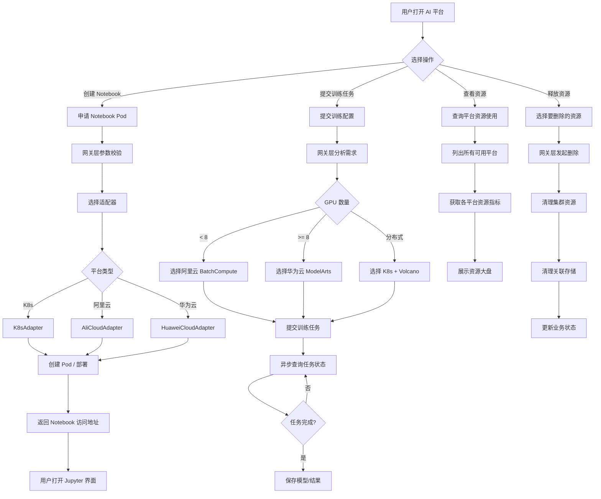
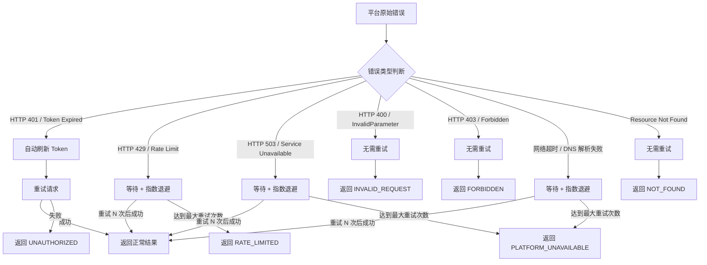

# AI 模型生产线 — 基础设施防腐网关层设计文档

> **版本**: v1.0  
> **最后更新**: 2026-04-24  
> **状态**: 草案  

---

## 目录

1. [背景与目标](#1-背景与目标)
2. [整体架构](#2-整体架构)
3. [防腐网关层设计](#3-防腐网关层设计)
4. [内部接口定义](#4-内部接口定义)
5. [数据模型](#5-数据模型)
6. [核心流程](#6-核心流程)
7. [外部平台适配器](#7-外部平台适配器)
8. [错误处理与重试策略](#8-错误处理与重试策略)
9. [安全设计](#9-安全设计)
10. [部署与配置](#10-部署与配置)
11. [附录：模拟接口说明](#11-附录模拟接口说明)

---

## 1. 背景与目标

### 1.1 背景

AI 模型生产线平台需要为用户提供 Jupyter Notebook 开发环境、模型训练任务提交、模型服务部署等核心能力。这些能力底层依赖 Kubernetes 集群进行 Pod 生命周期管理，以及对接各类算力调度平台（如阿里云 BatchCompute、华为云 ModelArts）进行大规模训练任务编排。

不同的基础设施平台（AWS EKS、阿里云 ACK、华为云 CCE、自建 K8s）以及不同的算力调度平台（阿里云 BatchCompute、华为云 ModelArts 等）在 API 语义、认证方式、资源模型、错误处理等方面存在显著差异。若上游业务代码直接依赖这些外部平台的 API，将导致：

- 业务逻辑与基础设施细节高度耦合
- 切换或新增平台时需要大规模修改业务代码
- 难以进行单元测试和本地开发
- 平台升级或 API 变更时牵一发而动全身

### 1.2 目标

设计并实现一个 **防腐网关层（Anti-Corruption Gateway Layer）**，达成以下目标：

| 目标 | 说明 |
|------|------|
| **解耦** | 将业务逻辑与基础设施平台 API 完全隔离 |
| **可移植** | 切换底层平台（如从阿里云迁移到华为云）时，上层业务代码零修改 |
| **可测试** | 通过 Mock 适配器支持本地开发与自动化测试 |
| **统一语义** | 屏蔽不同平台在错误码、重试策略、认证方式上的差异 |
| **可扩展** | 新增平台时只需添加新的适配器实现，无需修改网关核心与业务层 |

### 1.3 关键术语

| 术语 | 说明 |
|------|------|
| **Pod** | K8s 中的最小部署单元，在此架构中映射为用户 Notebook 实例或模型服务实例 |
| **Task** | 提交到算力调度平台的训练/推理任务 |
| **Adapter** | 适配器，实现对特定基础设施平台的 API 封装 |
| **Gateway** | 防腐网关，对内提供统一接口，对外通过 Adapter 调用不同平台 |
| **Compute Platform** | 算力调度平台，如阿里云 BatchCompute、华为云 ModelArts |
| **Cluster Platform** | 容器集群平台，如 AWS EKS、阿里云 ACK、华为云 CCE |

---

## 2. 整体架构

### 2.1 系统层次架构

```
┌─────────────────────────────────────────────────────────────────────────────┐
│                        AI Model Pipeline Application                        │
│  ┌─────────────┐  ┌───────────────┐  ┌──────────────┐  ┌───────────────┐  │
│  │ Notebook    │  │ Training      │  │ Model        │  │ Experiment   │  │
│  │ Manager     │  │ Pipeline Mgr  │  │ Serving Mgr  │  │ Tracker      │  │
│  └──────┬──────┘  └───────┬───────┘  └──────┬───────┘  └───────┬───────┘  │
│         │                 │                  │                  │          │
│         └─────────────────┼──────────────────┼──────────────────┘          │
│                           │                  │                             │
├───────────────────────────┼──────────────────┼─────────────────────────────┤
│                    ┌──────┴──────────────────┴──────┐                      │
│                    │     Anti-Corruption Gateway      │                      │
│                    │          (防腐网关层)            │                      │
│                    ├─────────────────────────────────┤                      │
│                    │  IComputeResourceGateway         │                      │
│                    │  ┌───────────────────────────┐  │                      │
│                    │  │ Pod Operations             │  │                      │
│                    │  │ - createPod / deletePod    │  │                      │
│                    │  │ - getPodStatus / listPods  │  │                      │
│                    │  │ - getPodLogs / execPod     │  │                      │
│                    │  └───────────────────────────┘  │                      │
│                    │  ┌───────────────────────────┐  │                      │
│                    │  │ Task Operations             │  │                      │
│                    │  │ - submitTask / cancelTask   │  │                      │
│                    │  │ - getTaskStatus / listTasks │  │                      │
│                    │  └───────────────────────────┘  │                      │
│                    │  ┌───────────────────────────┐  │                      │
│                    │  │ Resource Operations        │  │                      │
│                    │  │ - getResourceUsage         │  │                      │
│                    │  │ - listAvailablePlatforms   │  │                      │
│                    │  └───────────────────────────┘  │                      │
│                    └────────────────┬────────────────┘                      │
│                                     │                                       │
│                    ┌────────────────┴────────────────┐                      │
│                    │       Adapter Registry          │                      │
│                    │  (策略模式 + 工厂模式)          │                      │
│                    └────────────────┬────────────────┘                      │
│                                     │                                       │
├─────────────────────────────────────┼───────────────────────────────────────┤
│                                     │                                       │
│  ┌──────────┐  ┌──────────┐  ┌─────┴─────┐  ┌──────────┐  ┌──────────┐   │
│  │ K8s      │  │ AWS EKS  │  │ 阿里云 ACK │  │ 华为云    │  │ Mock     │   │
│  │ Adapter  │  │ Adapter  │  │  Adapter   │  │ CCE       │  │ Adapter  │   │
│  │          │  │          │  │            │  │ Adapter   │  │          │   │
│  └────┬─────┘  └────┬─────┘  └─────┬──────┘  └─────┬─────┘  └─────┬────┘   │
│       │              │              │               │              │        │
│  ┌────┴─────┐  ┌─────┴──────┐  ┌───┴────────┐  ┌───┴────────┐  ┌─┴──────┐ │
│  │ 自建K8s  │  │ AWS EKS   │  │阿里云 ACK  │  │华为云 CCE  │  │ 本地    │ │
│  │ 集群     │  │ 集群       │  │ 集群        │  │ 集群       │  │ 模拟    │ │
│  └──────────┘  └────────────┘  └────────────┘  └────────────┘  └─────────┘ │
│                                                                             │
│  ┌─────────────┐  ┌─────────────────┐  ┌──────────────────┐               │
│  │ 阿里云       │  │ 华为云           │  │ AWS              │               │
│  │ BatchCompute │  │ ModelArts       │  │ SageMaker        │               │
│  └─────────────┘  └─────────────────┘  └──────────────────┘               │
│                        算力调度平台                                         │
└─────────────────────────────────────────────────────────────────────────────┘
```

### 2.2 防腐网关在系统中的位置

```
                          ┌──────────────────────┐
                          │    User / Frontend    │
                          └──────────┬───────────┘
                                     │ HTTP/gRPC
                          ┌──────────┴───────────┐
                          │   Application Layer   │
                          │  (业务编排层)          │
                          └──────────┬───────────┘
                                     │ 调用网关接口
                          ┌──────────┴───────────┐
                          │  Anti-Corruption     │ ◄─── 防腐边界
                          │  Gateway (ACG)       │
                          └──────────┬───────────┘
                                     │ 通过 Adapter 调用
                    ┌────────────────┼────────────────┐
                    │                │                │
             ┌──────┴──────┐  ┌─────┴─────┐  ┌──────┴──────┐
             │  K8s API     │  │  阿里云    │  │  华为云     │
             │  (集群管理)   │  │  SDK/API   │  │  SDK/API    │
             └──────┬──────┘  └─────┬─────┘  └──────┬──────┘
                    │                │                │
             ┌──────┴──────┐  ┌─────┴─────┐  ┌──────┴──────┐
             │  AWS EKS /  │  │ 阿里云 ACK │  │ 华为云 CCE  │
             │  自建 K8s   │  │ +BatchComp │  │ +ModelArts  │
             └─────────────┘  └───────────┘  └─────────────┘
```

### 2.3 设计模式

| 模式 | 用途 | 实现位置 |
|------|------|----------|
| **策略模式** | 不同平台使用不同 Adapter 实现 | Adapter Registry |
| **工厂模式** | 根据配置创建对应的 Adapter 实例 | AdapterFactory |
| **适配器模式** | 将各平台差异 API 转换为统一接口 | 各 PlatformAdapter |
| **模板方法** | 统一重试、鉴权、日志等横切逻辑 | BaseAdapter |
| **外观模式** | 对外提供简洁的统一接口 | IComputeResourceGateway |

---

## 3. 防腐网关层设计

### 3.1 核心接口设计

防腐网关层提供三大类核心操作，通过统一的 `IComputeResourceGateway` 接口暴露给上层业务：

```
┌─────────────────────────────────────────────────────────┐
│              IComputeResourceGateway                     │
├─────────────────────────────────────────────────────────┤
│  ┌───────────────────────────────────────────────────┐  │
│  │  Pod 生命周期管理                                  │  │
│  │  ┌──────────┐  ┌──────────┐  ┌──────────┐        │  │
│  │  │createPod │  │deletePod │  │getPod    │        │  │
│  │  │          │  │          │  │Status    │        │  │
│  │  └──────────┘  └──────────┘  └──────────┘        │  │
│  │  ┌──────────┐  ┌──────────┐  ┌──────────┐        │  │
│  │  │listPods  │  │getPodLogs│  │execPod   │        │  │
│  │  └──────────┘  └──────────┘  └──────────┘        │  │
│  └───────────────────────────────────────────────────┘  │
│  ┌───────────────────────────────────────────────────┐  │
│  │  算力任务调度                                       │  │
│  │  ┌──────────┐  ┌──────────┐  ┌──────────┐        │  │
│  │  │submitTask│  │getTask   │  │cancelTask│        │  │
│  │  │          │  │Status    │  │          │        │  │
│  │  └──────────┘  └──────────┘  └──────────┘        │  │
│  │  ┌──────────┐  ┌──────────┐                       │  │
│  │  │listTasks │  │getTaskLog│                       │  │
│  │  └──────────┘  └──────────┘                       │  │
│  └───────────────────────────────────────────────────┘  │
│  ┌───────────────────────────────────────────────────┐  │
│  │  资源查询                                          │  │
│  │  ┌──────────┐  ┌──────────┐                       │  │
│  │  │getResource│  │listAvail │                       │  │
│  │  │Usage      │  │ablePlatfm│                       │  │
│  │  └──────────┘  └──────────┘                       │  │
│  └───────────────────────────────────────────────────┘  │
└─────────────────────────────────────────────────────────┘
```

### 3.2 适配器层次

```
┌──────────────────────────────────────────────────┐
│               BaseAdapter                         │
│  ┌───────────────────────────────────────────┐   │
│  │  公共横切逻辑：                              │   │
│  │  ✅ 认证 / Token 管理                       │   │
│  │  ✅ 请求重试 (exponential backoff)          │   │
│  │  ✅ 请求日志 / 链路追踪                      │   │
│  │  ✅ 错误转换 (平台异常 → 统一错误)           │   │
│  │  ✅ 限流 / 速率控制                          │   │
│  │  ✅ 指标上报 (Metrics)                      │   │
│  └───────────────────────────────────────────┘   │
└──────────────────────┬───────────────────────────┘
                       │ 继承
         ┌─────────────┼─────────────┐
         │             │             │
┌────────┴─────┐ ┌─────┴──────┐ ┌───┴──────────┐
│ K8sAdapter   │ │AliCloud    │ │HuaweiCloud   │
│              │ │Adapter     │ │Adapter       │
├──────────────┤ ├────────────┤ ├──────────────┤
│ - kubeconfig │ │ - accessKey│ │ - accessKey  │
│ - context    │ │ - secretKey│ │ - secretKey  │
│ - namespace  │ │ - region   │ │ - region     │
│              │ │ - endpoint │ │ - endpoint   │
└──────────────┘ └────────────┘ └──────────────┘
```

### 3.3 适配器选择策略

```
                    ┌─────────────────────┐
                    │   配置中心            │
                    │  (Config Center)     │
                    └──────────┬──────────┘
                               │ 平台映射规则
                               │
                    ┌──────────┴──────────┐
                    │   AdapterFactory    │
                    │                     │
                    │  根据配置选择适配器   │
                    └──────────┬──────────┘
                               │
          ┌────────────────────┼────────────────────┐
          │  platform="k8s"    │  region+tags       │  platform="aliyun"
          ▼                    ▼                    ▼
   ┌──────────────┐   ┌──────────────┐   ┌──────────────┐
   │ K8sAdapter   │   │ AliCloud     │   │ HuaweiCloud  │
   │              │   │ Adapter      │   │ Adapter      │
   └──────────────┘   └──────────────┘   └──────────────┘
```

**适配器选择规则示例（YAML 配置）**：

```yaml
gateway:
  platform-mapping:
    # 默认 Notebook 创建走 K8s 适配器
    - type: notebook
      platform: k8s
      adapter: k8s-adapter
    
    # 训练任务提交到阿里云
    - type: training
      platform: aliyun
      adapter: aliyun-adapter
      tags:
        env: production
    
    # 大规模训练提交到华为云
    - type: training-large-scale
      platform: huawei
      adapter: huawei-adapter
      condition: "resources.gpu > 8"
    
    # 本地开发使用 Mock 适配器
    - type: all
      platform: mock
      adapter: mock-adapter
      tags:
        env: development
```

---

## 4. 内部接口定义

### 4.1 网关主接口（IComputeResourceGateway）

#### 4.1.1 Pod 操作

```go
// IComputeResourceGateway 防腐网关统一接口
type IComputeResourceGateway interface {
    // ============= Pod 生命周期管理 =============

    // CreatePod 创建 Pod (用于 Notebook / 模型服务等)
    CreatePod(ctx context.Context, req *CreatePodRequest) (*PodInfo, error)

    // DeletePod 删除指定 Pod
    DeletePod(ctx context.Context, podID string) error

    // GetPodStatus 获取 Pod 状态
    GetPodStatus(ctx context.Context, podID string) (*PodStatus, error)

    // ListPods 按条件查询 Pod 列表
    ListPods(ctx context.Context, req *ListPodsRequest) ([]*PodInfo, error)

    // GetPodLogs 获取 Pod 日志
    GetPodLogs(ctx context.Context, podID string, opts *PodLogOptions) (string, error)

    // ExecPod 在 Pod 中执行命令 (交互式调试)
    ExecPod(ctx context.Context, podID string, cmd []string) (*ExecResult, error)

    // WatchPodEvents 监听 Pod 事件 (WebSocket / SSE)
    WatchPodEvents(ctx context.Context, podID string) (<-chan *PodEvent, error)

    // ============= 算力任务调度 =============

    // SubmitTask 提交训练/推理任务
    SubmitTask(ctx context.Context, req *SubmitTaskRequest) (*TaskInfo, error)

    // GetTaskStatus 获取任务状态
    GetTaskStatus(ctx context.Context, taskID string) (*TaskStatus, error)

    // CancelTask 取消任务
    CancelTask(ctx context.Context, taskID string) error

    // ListTasks 查询任务列表
    ListTasks(ctx context.Context, req *ListTasksRequest) ([]*TaskInfo, error)

    // GetTaskLogs 获取任务日志
    GetTaskLogs(ctx context.Context, taskID string, opts *TaskLogOptions) (string, error)

    // ============= 资源与平台查询 =============

    // GetResourceUsage 获取指定平台的资源使用情况
    GetResourceUsage(ctx context.Context, platform string) (*ResourceUsage, error)

    // ListAvailablePlatforms 列出当前可用的平台
    ListAvailablePlatforms(ctx context.Context) ([]*PlatformInfo, error)
}
```

#### 4.1.2 RESTful API 映射

防腐网关层同时也暴露 RESTful API 供前端或其他服务调用：

| 方法 | 路径 | 说明 |
|------|------|------|
| POST | `/api/v1/pods` | 创建 Pod |
| DELETE | `/api/v1/pods/{podId}` | 删除 Pod |
| GET | `/api/v1/pods/{podId}` | 获取 Pod 状态 |
| GET | `/api/v1/pods` | 列举 Pod |
| GET | `/api/v1/pods/{podId}/logs` | 获取 Pod 日志 |
| POST | `/api/v1/pods/{podId}/exec` | 在 Pod 中执行命令 |
| GET | `/api/v1/pods/{podId}/events` | 监听 Pod 事件 (SSE) |
| POST | `/api/v1/tasks` | 提交任务 |
| GET | `/api/v1/tasks/{taskId}` | 获取任务状态 |
| DELETE | `/api/v1/tasks/{taskId}` | 取消任务 |
| GET | `/api/v1/tasks` | 列举任务 |
| GET | `/api/v1/tasks/{taskId}/logs` | 获取任务日志 |
| GET | `/api/v1/platforms` | 列举可用平台 |
| GET | `/api/v1/platforms/{platform}/usage` | 获取平台资源使用 |

### 4.2 适配器接口（PlatformAdapter）

```go
// PlatformAdapter 平台适配器接口 — 每个平台实现此接口
type PlatformAdapter interface {
    // 基本信息
    // Name 返回适配器名称
    Name() string
    // PlatformType 返回平台类型 (k8s, aliyun, huawei, mock)
    PlatformType() PlatformType
    // IsAvailable 检测平台当前是否可用
    IsAvailable(ctx context.Context) bool

    // ===== Pod 接口 =====
    CreatePod(ctx context.Context, req *CreatePodRequest) (*PodInfo, error)
    DeletePod(ctx context.Context, podID string) error
    GetPodStatus(ctx context.Context, podID string) (*PodStatus, error)
    ListPods(ctx context.Context, req *ListPodsRequest) ([]*PodInfo, error)
    GetPodLogs(ctx context.Context, podID string, opts *PodLogOptions) (string, error)
    ExecPod(ctx context.Context, podID string, cmd []string) (*ExecResult, error)

    // ===== 任务接口 =====
    SubmitTask(ctx context.Context, req *SubmitTaskRequest) (*TaskInfo, error)
    GetTaskStatus(ctx context.Context, taskID string) (*TaskStatus, error)
    CancelTask(ctx context.Context, taskID string) error
    ListTasks(ctx context.Context, req *ListTasksRequest) ([]*TaskInfo, error)
    GetTaskLogs(ctx context.Context, taskID string, opts *TaskLogOptions) (string, error)

    // ===== 资源接口 =====
    GetResourceUsage(ctx context.Context) (*ResourceUsage, error)
}

// PlatformType 平台类型枚举
type PlatformType string

const (
    PlatformK8s    PlatformType = "k8s"
    PlatformEKS    PlatformType = "eks"
    PlatformAliyun PlatformType = "aliyun"
    PlatformHuawei PlatformType = "huawei"
    PlatformMock   PlatformType = "mock"
)
```

### 4.3 基础适配器（BaseAdapter）

```go
// BaseAdapter 提供公共横切逻辑，所有具体适配器组合此基类
type BaseAdapter struct {
    config     *AdapterConfig
    logger     log.Logger
    metrics    MetricsRecorder
    retrier    *RetryPolicy
    rateLimiter *RateLimiter
}

// AdapterConfig 适配器通用配置
type AdapterConfig struct {
    // 平台认证
    AccessKey       string `yaml:"access_key"`
    SecretKey       string `yaml:"secret_key"`
    Region          string `yaml:"region"`
    Endpoint        string `yaml:"endpoint"`
    
    // K8s 专用
    KubeConfigPath  string `yaml:"kube_config_path"`
    KubeContext     string `yaml:"kube_context"`
    DefaultNamespace string `yaml:"default_namespace"`
    
    // 网络配置
    Timeout         time.Duration `yaml:"timeout"`
    MaxRetries      int           `yaml:"max_retries"`
    RetryInterval   time.Duration `yaml:"retry_interval"`
    
    // 限流
    RateLimit       int           `yaml:"rate_limit"`
    BurstSize       int           `yaml:"burst_size"`
}

// BaseAdapter 提供的通用方法
func (b *BaseAdapter) withRetry(ctx context.Context, operation string, fn func() error) error {
    return b.retrier.Do(ctx, operation, fn)
}

func (b *BaseAdapter) withRateLimit(ctx context.Context) error {
    return b.rateLimiter.Wait(ctx)
}

func (b *BaseAdapter) recordMetrics(operation string, duration time.Duration, err error) {
    b.metrics.Record(operation, duration, err)
}

// convertError 将平台特定错误转换为统一错误
func (b *BaseAdapter) convertError(platformErr error) *GatewayError {
    // 由子类覆盖实现
    return &GatewayError{
        Code:    ErrUnknown,
        Message: platformErr.Error(),
    }
}
```

---

## 5. 数据模型

### 5.1 核心数据模型

```go
// ==================== Pod 相关 ====================

// CreatePodRequest 创建 Pod 请求
type CreatePodRequest struct {
    Name             string            `json:"name"`              // Pod 名称
    Namespace        string            `json:"namespace"`         // 命名空间
    Image            string            `json:"image"`             // 容器镜像
    ResourceReq      *ResourceSpec     `json:"resource_req"`      // 资源需求
    EnvVars          map[string]string `json:"env_vars"`           // 环境变量
    VolumeMounts     []*VolumeMount    `json:"volume_mounts"`      // 存储挂载
    Labels           map[string]string `json:"labels"`             // 标签
    Annotations      map[string]string `json:"annotations"`        // 注解
    Command          []string          `json:"command"`            // 启动命令
    Args             []string          `json:"args"`               // 启动参数
    NodeSelector     map[string]string `json:"node_selector"`      // 节点选择
    Tolerations      []*Toleration     `json:"tolerations"`        // 容忍度
    GPUSpec          *GPUSpec          `json:"gpu_spec"`           // GPU 规格
    NetworkSpec      *NetworkSpec      `json:"network_spec"`       // 网络配置
    LifecycleHook    *LifecycleHook    `json:"lifecycle_hook"`     // 生命周期钩子
    TimeoutSeconds   int32             `json:"timeout_seconds"`    // Pod 超时时间
    SchedulerName    string            `json:"scheduler_name"`     // 调度器名称
    PriorityClassName string           `json:"priority_class_name"` // 优先级类
}

// PodInfo Pod 信息
type PodInfo struct {
    ID                string            `json:"id"`                 // Pod ID (UUID)
    Name              string            `json:"name"`               // Pod 名称
    Namespace         string            `json:"namespace"`          // 命名空间
    Status            PodStatus         `json:"status"`             // 状态
    NodeName          string            `json:"node_name"`          // 所在节点
    HostIP            string            `json:"host_ip"`            // 主机 IP
    PodIP             string            `json:"pod_ip"`             // Pod IP
    ResourceUsage     *ResourceUsage    `json:"resource_usage"`     // 当前资源使用
    CreatedAt         time.Time         `json:"created_at"`         // 创建时间
    UpdatedAt         time.Time         `json:"updated_at"`         // 更新时间
    Labels            map[string]string `json:"labels"`             // 标签
    Platform          PlatformType      `json:"platform"`           // 所在平台
    ClusterName       string            `json:"cluster_name"`       // 集群名称
    RestartCount      int32             `json:"restart_count"`      // 重启次数
    Conditions        []*PodCondition   `json:"conditions"`         // Pod 条件
}

// PodStatus Pod 状态
type PodStatus string

const (
    PodStatusPending   PodStatus = "Pending"
    PodStatusRunning   PodStatus = "Running"
    PodStatusSucceeded PodStatus = "Succeeded"
    PodStatusFailed    PodStatus = "Failed"
    PodStatusUnknown   PodStatus = "Unknown"
    PodStatusCrashLoop PodStatus = "CrashLoopBackOff"
    PodStatusEvicted   PodStatus = "Evicted"
    PodStatusCreating  PodStatus = "Creating"      // 中间状态：创建中
    PodStatusDeleting  PodStatus = "Deleting"      // 中间状态：删除中
)

// ResourceSpec 资源规格
type ResourceSpec struct {
    CPU        string `json:"cpu"`         // e.g. "4"
    Memory     string `json:"memory"`      // e.g. "16Gi"
    GPU        int32  `json:"gpu"`         // GPU 数量
    GPUMemory  string `json:"gpu_memory"`  // GPU 显存
    GPUType    string `json:"gpu_type"`    // GPU 类型: A100, V100, T4
    EphemeralStorage string `json:"ephemeral_storage"` // 临时存储
}

// GPUSpec GPU 规格
type GPUSpec struct {
    GPUNumber        int32  `json:"gpu_number"`
    GPUType          string `json:"gpu_type"`          // A100-80G, V100-32G, T4-16G, Ascend-910
    GPUMemoryPerCard string `json:"gpu_memory_per_card"`
    MIGProfile       string `json:"mig_profile"`       // MIG 配置 (NVIDIA)
    SharingStrategy  string `json:"sharing_strategy"`  // time-slicing, mps, m ig
}

// VolumeMount 存储挂载
type VolumeMount struct {
    Name        string `json:"name"`
    MountPath   string `json:"mount_path"`
    SubPath     string `json:"sub_path"`
    ReadOnly    bool   `json:"read_only"`
    VolumeType  string `json:"volume_type"`  // pvc, hostpath, emptyDir, nfs, cfs, obs, nas
    VolumeID    string `json:"volume_id"`    // 对应存储的 ID
    Size        string `json:"size"`         // 存储大小
    StorageClass string `json:"storage_class"`
}

// NetworkSpec 网络配置
type NetworkSpec struct {
    SecurityGroups  []string          `json:"security_groups"`
    Subnets         []string          `json:"subnets"`
    UseHostNetwork  bool              `json:"use_host_network"`
    DNSConfig       *DNSConfig        `json:"dns_config"`
    PortMappings    []*PortMapping    `json:"port_mappings"`
    IngressEnabled  bool              `json:"ingress_enabled"`
    IngressHost     string            `json:"ingress_host"`
    ServiceType     string            `json:"service_type"` // ClusterIP, NodePort, LoadBalancer
}

// ListPodsRequest 列举 Pod 请求
type ListPodsRequest struct {
    Namespace       string            `json:"namespace"`
    Labels          map[string]string  `json:"labels"`
    Status          PodStatus          `json:"status"`
    Page            int32              `json:"page"`
    PageSize        int32              `json:"page_size"`
    SortBy          string             `json:"sort_by"`
    SortOrder       string             `json:"sort_order"`  // asc, desc
}

// PodLogOptions Pod 日志选项
type PodLogOptions struct {
    Container    string `json:"container"`
    TailLines    int64  `json:"tail_lines"`
    SinceSeconds int64  `json:"since_seconds"`
    Timestamps   bool   `json:"timestamps"`
    Follow       bool   `json:"follow"` // 流式跟随
}

// ExecResult 执行命令结果
type ExecResult struct {
    Stdout   string `json:"stdout"`
    Stderr   string `json:"stderr"`
    ExitCode int    `json:"exit_code"`
}

// PodEvent Pod 事件
type PodEvent struct {
    Type      string    `json:"type"`       // Normal, Warning, Error
    Reason    string    `json:"reason"`     // Pulled, Created, Started, BackOff
    Message   string    `json:"message"`
    Timestamp time.Time `json:"timestamp"`
    Source    string    `json:"source"`
}

// ==================== 任务相关 ====================

// SubmitTaskRequest 提交任务请求
type SubmitTaskRequest struct {
    Name            string            `json:"name"`              // 任务名称
    Type            TaskType          `json:"type"`              // 任务类型
    Image           string            `json:"image"`             // 镜像
    Command         []string          `json:"command"`           // 命令
    Args            []string          `json:"args"`              // 参数
    ResourceReq     *ResourceSpec     `json:"resource_req"`      // 资源需求
    WorkerCount     int32             `json:"worker_count"`      // 分布式 Worker 数
    WorkerSpec      *ResourceSpec     `json:"worker_spec"`       // Worker 资源规格
    EnvVars         map[string]string `json:"env_vars"`           // 环境变量
    Volumes         []*VolumeMount    `json:"volumes"`            // 存储
    Labels          map[string]string `json:"labels"`             // 标签
    MaxRetries      int32             `json:"max_retries"`        // 最大重试次数
    Timeout         int64             `json:"timeout"`            // 超时时间 (秒)
    CallbackURL     string            `json:"callback_url"`       // 回调 URL
    Priority        int32             `json:"priority"`           // 优先级
    QueueName       string            `json:"queue_name"`         // 队列名称
    Dependencies    []string          `json:"dependencies"`       // 依赖任务 ID 列表
    OutputConfig    *OutputConfig     `json:"output_config"`      // 输出配置
    Tags            map[string]string `json:"tags"`               // 自定义标签
}

// TaskType 任务类型
type TaskType string

const (
    TaskTypeTraining     TaskType = "training"
    TaskTypeEvaluation   TaskType = "evaluation"
    TaskTypeInference    TaskType = "inference"
    TaskTypeDataProcess  TaskType = "data_process"
    TaskTypeNotebook     TaskType = "notebook"
    TaskTypeCustom       TaskType = "custom"
)

// TaskInfo 任务信息
type TaskInfo struct {
    ID            string            `json:"id"`
    Name          string            `json:"name"`
    Type          TaskType          `json:"type"`
    Status        TaskStatus        `json:"status"`
    Progress      float32           `json:"progress"`       // 0.0 - 1.0
    ResourceUsed  *ResourceUsage    `json:"resource_used"`
    StartedAt     *time.Time        `json:"started_at"`
    FinishedAt    *time.Time        `json:"finished_at"`
    Duration      int64             `json:"duration"`       // 秒
    ErrorMessage  string            `json:"error_message"`
    WorkerCount   int32             `json:"worker_count"`
    Platform      PlatformType      `json:"platform"`
    QueuePosition int32             `json:"queue_position"` // 队列位置
    Tags          map[string]string `json:"tags"`
    CreatedAt     time.Time         `json:"created_at"`
    UpdatedAt     time.Time         `json:"updated_at"`
}

// TaskStatus 任务状态
type TaskStatus string

const (
    TaskStatusPending    TaskStatus = "Pending"      // 排队中
    TaskStatusRunning    TaskStatus = "Running"      // 运行中
    TaskStatusSucceeded  TaskStatus = "Succeeded"    // 成功
    TaskStatusFailed     TaskStatus = "Failed"       // 失败
    TaskStatusCancelled  TaskStatus = "Cancelled"    // 已取消
    TaskStatusRetrying   TaskStatus = "Retrying"     // 重试中
    TaskStatusPaused     TaskStatus = "Paused"       // 已暂停
    TaskStatusSubmitted  TaskStatus = "Submitted"    // 已提交
)

// ListTasksRequest 列举任务请求
type ListTasksRequest struct {
    Type     TaskType          `json:"type"`
    Status   TaskStatus        `json:"status"`
    Labels   map[string]string `json:"labels"`
    Page     int32             `json:"page"`
    PageSize int32             `json:"page_size"`
    SortBy   string            `json:"sort_by"`
    SortOrder string           `json:"sort_order"`
}

// TaskLogOptions 任务日志选项
type TaskLogOptions struct {
    WorkerIndex int32  `json:"worker_index"`
    TailLines   int64  `json:"tail_lines"`
    Follow      bool   `json:"follow"`
}

// ==================== 资源相关 ====================

// ResourceUsage 资源使用情况
type ResourceUsage struct {
    Platform      PlatformType  `json:"platform"`
    ClusterName   string        `json:"cluster_name"`

    // 总量
    TotalCPU      string        `json:"total_cpu"`       // e.g. "128"
    TotalMemory   string        `json:"total_memory"`    // e.g. "512Gi"
    TotalGPU      int32         `json:"total_gpu"`
    TotalNodes    int32         `json:"total_nodes"`

    // 已使用
    UsedCPU       string        `json:"used_cpu"`
    UsedMemory    string        `json:"used_memory"`
    UsedGPU       int32         `json:"used_gpu"`

    // 配额
    QuotaCPU      string        `json:"quota_cpu"`
    QuotaMemory   string        `json:"quota_memory"`
    QuotaGPU      int32         `json:"quota_gpu"`

    // 利用率百分比
    CPUUsagePercent    float64  `json:"cpu_usage_percent"`
    MemoryUsagePercent float64  `json:"memory_usage_percent"`
    GPUUsagePercent    float64  `json:"gpu_usage_percent"`

    // 按 GPU 类型细分
    GPUDetail    map[string]*GPUResourceDetail `json:"gpu_detail"`

    UpdatedAt    time.Time `json:"updated_at"`
}

type GPUResourceDetail struct {
    Total     int32   `json:"total"`
    Used      int32   `json:"used"`
    Available int32   `json:"available"`
}

// PlatformInfo 平台信息
type PlatformInfo struct {
    Name        PlatformType        `json:"name"`
    DisplayName string              `json:"display_name"`
    Region      string              `json:"region"`
    Version     string              `json:"version"`
    Status      string              `json:"status"`      // online, offline, degraded
    Features    []string            `json:"features"`    // 支持的功能列表
    Capabilities map[string]bool    `json:"capabilities"` // pod, task, gpu, distributed
    GPUTypes    []string            `json:"gpu_types"`    // 可用的 GPU 类型
    MaxGPUs     int32               `json:"max_gpus"`     // 单任务最大 GPU
    CostPerHour map[string]float64  `json:"cost_per_hour"` // 各实例类型每小时费用
    Labels      map[string]string   `json:"labels"`
}

// ==================== 统一错误 ====================

// GatewayError 网关统一错误
type GatewayError struct {
    Code        ErrorCode     `json:"code"`
    Message     string        `json:"message"`
    Detail      string        `json:"detail,omitempty"`
    PlatformErr string        `json:"platform_err,omitempty"` // 原始平台错误
    Retryable   bool          `json:"retryable"`
    StatusCode  int           `json:"status_code"` // HTTP 状态码映射
}

type ErrorCode string

const (
    ErrInvalidRequest      ErrorCode = "INVALID_REQUEST"
    ErrUnauthorized        ErrorCode = "UNAUTHORIZED"
    ErrForbidden           ErrorCode = "FORBIDDEN"
    ErrNotFound            ErrorCode = "NOT_FOUND"
    ErrAlreadyExists       ErrorCode = "ALREADY_EXISTS"
    ErrResourceExhausted   ErrorCode = "RESOURCE_EXHAUSTED"
    ErrQuotaExceeded       ErrorCode = "QUOTA_EXCEEDED"
    ErrRateLimited         ErrorCode = "RATE_LIMITED"
    ErrPlatformUnavailable ErrorCode = "PLATFORM_UNAVAILABLE"
    ErrDeadlineExceeded    ErrorCode = "DEADLINE_EXCEEDED"
    ErrInternal            ErrorCode = "INTERNAL_ERROR"
    ErrUnknown             ErrorCode = "UNKNOWN"
    ErrPodCrashLoop        ErrorCode = "POD_CRASH_LOOP"
    ErrTaskFailed          ErrorCode = "TASK_FAILED"
    ErrPlatformNotSupport  ErrorCode = "PLATFORM_NOT_SUPPORT"
)
```

---

## 6. 核心流程

### 6.1 Pod 创建流程



### 6.2 Pod 创建内部时序



### 6.3 任务提交与调度流程



### 6.4 Pod 删除流程



### 6.5 状态监听与事件推送



### 6.6 整体业务流程图



---

## 7. 外部平台适配器

### 7.1 适配器总览

| 适配器 | 平台类型 | 管理平台 | 算力调度 | 适用场景 |
|--------|----------|----------|----------|----------|
| `K8sAdapter` | k8s | 自建 K8s / Kubeconfig | Kubernetes + Volcano | 本地开发/私有化部署 |
| `EKSAdapter` | eks | AWS EKS | AWS Batch + SageMaker | AWS 环境 |
| `AliCloudAdapter` | aliyun | 阿里云 ACK | 阿里云 BatchCompute / PAI | 阿里云环境 |
| `HuaweiCloudAdapter` | huawei | 华为云 CCE | 华为云 ModelArts | 华为云环境 |
| `MockAdapter` | mock | 内存模拟 | 内存模拟 | 开发测试 |

### 7.2 K8s 适配器 (K8sAdapter)

```go
// K8sAdapter 直接操作 K8s 集群
type K8sAdapter struct {
    BaseAdapter
    client    kubernetes.Interface
    namespace string
}

func NewK8sAdapter(config *AdapterConfig) (*K8sAdapter, error) {
    // 1. 加载 kubeconfig
    restConfig, err := clientcmd.BuildConfigFromFlags("", config.KubeConfigPath)
    // 2. 创建 clientset
    client, err := kubernetes.NewForConfig(restConfig)
    // 3. 初始化 BaseAdapter
    return &K8sAdapter{
        BaseAdapter: BaseAdapter{config: config, /* ... */},
        client:      client,
        namespace:   config.DefaultNamespace,
    }, nil
}

// CreatePod 实现 - 使用 K8s API 创建 Pod
func (a *K8sAdapter) CreatePod(ctx context.Context, req *CreatePodRequest) (*PodInfo, error) {
    // 1. 限流
    a.withRateLimit(ctx)
    
    // 2. 构建 K8s PodSpec
    podSpec := a.buildPodSpec(req)
    
    // 3. 调用 K8s API (带重试)
    var pod *corev1.Pod
    err := a.withRetry(ctx, "CreatePod", func() error {
        var apiErr error
        pod, apiErr = a.client.CoreV1().Pods(req.Namespace).Create(ctx, podSpec, metav1.CreateOptions{})
        return apiErr
    })
    
    if err != nil {
        return nil, a.convertError(err)
    }
    
    // 4. 转换为统一 PodInfo
    return a.convertToPodInfo(pod), nil
}

// buildPodSpec 构建 K8s PodSpec
func (a *K8sAdapter) buildPodSpec(req *CreatePodRequest) *corev1.Pod {
    // 将 CreatePodRequest 转换为 K8s Pod 对象
    // 包括 Resource Requirements, Volumes, NodeSelector, Tolerations 等
    pod := &corev1.Pod{
        ObjectMeta: metav1.ObjectMeta{
            Name:        req.Name,
            Namespace:   req.Namespace,
            Labels:      a.mergeLabels(req.Labels),
            Annotations: a.mergeAnnotations(req.Annotations),
        },
        Spec: corev1.PodSpec{
            Containers: []corev1.Container{{
                Name:    "main",
                Image:   req.Image,
                Command: req.Command,
                Args:    req.Args,
                Env:     a.buildEnvVars(req.EnvVars),
                Resources: corev1.ResourceRequirements{
                    Requests: a.buildResourceList(req.ResourceReq),
                    Limits:   a.buildResourceList(req.ResourceReq),
                },
                VolumeMounts: a.buildVolumeMounts(req.VolumeMounts),
            }},
            NodeSelector:     req.NodeSelector,
            Tolerations:      a.buildTolerations(req.Tolerations),
            RestartPolicy:    corev1.RestartPolicyAlways,
        },
    }
    return pod
}
```

### 7.3 阿里云适配器 (AliCloudAdapter)

阿里云适配器需要对接以下产品：

| 产品 | 用途 | 对接接口 |
|------|------|----------|
| **ACK** (容器服务) | 集群管理 | `DescribeClusters`, `DescribeClusterNodes` |
| **ECS** (弹性计算) | Pod 底层计算资源 | `DescribeInstances`, `RunInstances` |
| **BatchCompute** (批量计算) | 训练任务调度 | `CreateJob`, `DeleteJob`, `GetJob`, `ListJobs` |
| **PAI** (机器学习平台) | 训练/推理任务 | `CreateTrainingJob`, `GetTrainingJob` |
| **NAS/CPFS** (文件存储) | 数据存储 | `CreateMountTarget`, `DescribeMountTargets` |
| **CR** (容器镜像服务) | 镜像管理 | `ListRepositories`, `GetRepository` |

```go
// AliCloudAdapter 阿里云适配器
type AliCloudAdapter struct {
    BaseAdapter
    // SDK 客户端
    ackClient     *ack.Client           // 容器服务
    ecsClient     *ecs.Client           // 弹性计算
    batchClient   *batchcompute.Client   // 批量计算
    paiClient     *pai.Client           // 机器学习平台
    region        string
    accountID     string
}

func NewAliCloudAdapter(config *AdapterConfig) (*AliCloudAdapter, error) {
    // 初始化阿里云 SDK Client
    cred, err := credentials.NewAccessKeyCredential(config.AccessKey, config.SecretKey)
    
    // 初始化各客户端
    ackClient, _ := ack.NewClientWithOptions(config.Region, cred)
    batchClient, _ := batchcompute.NewClient(/* ... */)
    paiClient, _ := pai.NewClient(/* ... */)
    
    return &AliCloudAdapter{
        BaseAdapter: BaseAdapter{config: config},
        ackClient:   ackClient,
        batchClient: batchClient,
        paiClient:   paiClient,
        region:      config.Region,
    }, nil
}

// SubmitTask 实现 - 提交任务到阿里云 BatchCompute
func (a *AliCloudAdapter) SubmitTask(ctx context.Context, req *SubmitTaskRequest) (*TaskInfo, error) {
    // 1. 构建 BatchCompute Job 请求
    jobReq := &batchcompute.CreateJobRequest{
        JobName:     req.Name,
        JobType:     "DAG",               // 有向无环图依赖
        Priority:    req.Priority,
        Timeout:     req.Timeout,
        AutoRelease: false,
    }
    
    // 配置 Task
    taskDef := &batchcompute.TaskDef{
        TaskName:  "training-task",
        DockerImage: req.Image,
        Cpu:       req.ResourceReq.CPU,
        Memory:    req.ResourceReq.Memory,
        Gpu:       req.ResourceReq.GPU,
        Command:   strings.Join(req.Command, " "),
        EnvVars:   req.EnvVars,
        RetryCount: req.MaxRetries,
    }
    
    // 2. 设置数据挂载
    if len(req.Volumes) > 0 {
        taskDef.Mounts = a.buildMounts(req.Volumes)
    }
    
    jobReq.Tasks = append(jobReq.Tasks, taskDef)
    
    // 3. 调用 BatchCompute API
    resp, err := a.batchClient.CreateJob(jobReq)
    if err != nil {
        return nil, a.convertError(err)
    }
    
    // 4. 转换为统一格式
    return &TaskInfo{
        ID:        resp.JobId,
        Name:      req.Name,
        Type:      req.Type,
        Status:    TaskStatusSubmitted,
        Platform:  PlatformAliyun,
        CreatedAt: time.Now(),
    }, nil
}

// GetTaskStatus 实现 - 查询 BatchCompute 任务状态
func (a *AliCloudAdapter) GetTaskStatus(ctx context.Context, taskID string) (*TaskStatus, error) {
    resp, err := a.batchClient.GetJob(taskID)
    if err != nil {
        return nil, a.convertError(err)
    }
    
    // 状态映射: BatchCompute -> 统一状态
    statusMap := map[string]TaskStatus{
        "New":        TaskStatusPending,
        "Running":    TaskStatusRunning,
        "Stopped":    TaskStatusCancelled,
        "Failed":     TaskStatusFailed,
        "Succeeded":  TaskStatusSucceeded,
        "Waiting":    TaskStatusPending,
    }
    
    return &TaskStatus{
        ID:         taskID,
        Status:     statusMap[resp.State],
        Progress:   resp.Progress,
        Message:    resp.StatusMessage,
    }, nil
}

// CreatePod 实现 - 在 ACK 上创建 Pod
func (a *AliCloudAdapter) CreatePod(ctx context.Context, req *CreatePodRequest) (*PodInfo, error) {
    // 阿里云 ACK 的 Pod 创建需要通过 K8s API
    // 实际是通过 K8sAdapter 的能力 + ACK 集群的 kubeconfig
    // 这里可以复用内部的 K8sAdapter 或直接调用 ACK 的 API
    // 
    // 方案一: 通过 K8s API (需要获取 ACK 集群的 kubeconfig)
    // 方案二: 通过 ACK 的 OpenAPI (ack.CreatePod)
    
    // 实际实现...
}
```

### 7.4 华为云适配器 (HuaweiCloudAdapter)

华为云适配器需要对接以下产品：

| 产品 | 用途 | 对接接口 |
|------|------|----------|
| **CCE** (云容器引擎) | 集群管理 | `CreateCluster`, `ListClusters`, `AddNode` |
| **ECS** (弹性云服务器) | 计算资源 | `CreateServers`, `ListServers` |
| **ModelArts** (AI 开发平台) | 训练/推理任务 | `CreateTrainingJob`, `ListTrainingJobs`, `ShowTrainingJob` |
| **SFS** (弹性文件服务) | 数据存储 | `CreateShare`, `ListShares` |
| **SWR** (容器镜像服务) | 镜像管理 | `ListImageTags`, `CreateRepository` |

```go
// HuaweiCloudAdapter 华为云适配器
type HuaweiCloudAdapter struct {
    BaseAdapter
    // SDK 客户端
    cceClient       *cce.CceClient
    ecsClient       *ecs.EcsClient
    modelArtsClient *modelarts.ModelArtsClient
    region          string
    projectID       string
}

func NewHuaweiCloudAdapter(config *AdapterConfig) (*HuaweiCloudAdapter, error) {
    // 初始化华为云认证
    auth, _ := basic.NewCredentialsBuilder().
        WithAk(config.AccessKey).
        WithSk(config.SecretKey).
        WithRegion(config.Region).
        Build()
    
    // 初始化各客户端
    cceClient, _ := cce.NewCceClient(auth)
    modelArtsClient, _ := modelarts.NewModelArtsClient(auth)
    
    return &HuaweiCloudAdapter{
        BaseAdapter:     BaseAdapter{config: config},
        cceClient:       cceClient,
        modelArtsClient: modelArtsClient,
        region:          config.Region,
    }, nil
}

// SubmitTask 实现 - 提交任务到华为云 ModelArts
func (a *HuaweiCloudAdapter) SubmitTask(ctx context.Context, req *SubmitTaskRequest) (*TaskInfo, error) {
    // 1. 构建 ModelArts 训练任务请求
    trainingReq := &modelarts.CreateTrainingJobRequest{
        JobName: req.Name,
        Algorithm: &modelarts.Algorithm{
            CodeDir:    req.Image,
            Command:    strings.Join(req.Command, " "),
            Parameters: a.buildParameters(req.Args),
        },
        Resources: &modelarts.Resource{
            FlavorId: a.selectFlavor(req.ResourceReq),
            Nodes:    req.WorkerCount,
        },
        InputData:  a.buildInputData(req.Volumes),
        OutputData: a.buildOutputData(req.OutputConfig),
        HookUrl:    req.CallbackURL,
    }
    
    // 2. 设置分布式配置
    if req.WorkerCount > 1 {
        trainingReq.Distribution = &modelarts.Distribution{
            WorkerNum:  req.WorkerCount,
            Framework:  "PyTorch",    // 或 TensorFlow / MindSpore
            FrameworkVersion: "2.0.0",
        }
    }
    
    // 3. 调用 ModelArts API
    resp, err := a.modelArtsClient.CreateTrainingJob(trainingReq)
    if err != nil {
        return nil, a.convertError(err)
    }
    
    return &TaskInfo{
        ID:        resp.TrainingId,
        Name:      req.Name,
        Status:    TaskStatusSubmitted,
        Platform:  PlatformHuawei,
        CreatedAt: time.Now(),
    }, nil
}

// 选择华为云实例规格 (Flavor)
func (a *HuaweiCloudAdapter) selectFlavor(spec *ResourceSpec) string {
    // GPU 类型到 ModelArts Flavor 的映射
    flavors := map[string]map[int32]string{
        "A100-80G": {
            1: "modelarts.p3.2xlarge",
            4: "modelarts.p3.8xlarge",
            8: "modelarts.p3.16xlarge",
        },
        "Ascend-910": {
            1: "modelarts.ni.4xlarge",
            8: "modelarts.ni.32xlarge",
        },
    }
    
    if flavorMap, ok := flavors[spec.GPUType]; ok {
        if flavor, ok := flavorMap[spec.GPU]; ok {
            return flavor
        }
    }
    
    // 默认规格
    return "modelarts.p3.2xlarge"
}

// GetTaskStatus 实现 - 查询 ModelArts 任务状态
func (a *HuaweiCloudAdapter) GetTaskStatus(ctx context.Context, taskID string) (*TaskStatus, error) {
    resp, err := a.modelArtsClient.ShowTrainingJob(taskID)
    if err != nil {
        return nil, a.convertError(err)
    }
    
    // 状态映射: ModelArts -> 统一状态
    statusMap := map[string]TaskStatus{
        "QUEUING":      TaskStatusPending,
        "INIT":         TaskStatusSubmitted,
        "RUNNING":      TaskStatusRunning,
        "COMPLETED":    TaskStatusSucceeded,
        "FAILED":       TaskStatusFailed,
        "TERMINATED":   TaskStatusCancelled,
    }
    
    return &TaskStatus{
        ID:       taskID,
        Status:   statusMap[resp.Status],
        Progress: resp.Progress,
        Message:  resp.Description,
    }, nil
}

// CreatePod 实现 - 在 CCE 上创建 Pod
func (a *HuaweiCloudAdapter) CreatePod(ctx context.Context, req *CreatePodRequest) (*PodInfo, error) {
    // 华为云 CCE 的 Pod 创建
    // 方案一: 通过 CCE 的 K8s API (需要获取集群证书)
    // 方案二: 通过 CCE OpenAPI 创建 Workload
    
    podReq := &cce.CreateWorkloadRequest{
        Namespace:  req.Namespace,
        WorkloadName: req.Name,
        Replicas:   1,
        Containers: []cce.Container{{
            Name:    "main",
            Image:   req.Image,
            Command: req.Command,
            Args:    req.Args,
            Limits: cce.ResourceLimit{
                CPU:    req.ResourceReq.CPU,
                Memory: req.ResourceReq.Memory,
                GPU:    req.ResourceReq.GPU,
            },
        }},
    }
    
    resp, err := a.cceClient.CreateDeployment(podReq)
    if err != nil {
        return nil, a.convertError(err)
    }
    
    return a.convertToPodInfo(resp), nil
}
```

### 7.5 Mock 适配器 (MockAdapter)

用于本地开发、测试和演示环境，不依赖任何真实基础设施。

```go
// MockAdapter 模拟适配器 - 用于开发/测试
type MockAdapter struct {
    BaseAdapter
    pods    map[string]*PodInfo    // 模拟 Pod 数据
    tasks   map[string]*TaskInfo   // 模拟任务数据
    mu      sync.RWMutex
    clock   func() time.Time       // 可注入时钟，用于测试
}

func NewMockAdapter(config *AdapterConfig) *MockAdapter {
    return &MockAdapter{
        BaseAdapter: BaseAdapter{config: config},
        pods:        make(map[string]*PodInfo),
        tasks:       make(map[string]*TaskInfo),
        clock:       time.Now,
    }
}

func (m *MockAdapter) CreatePod(ctx context.Context, req *CreatePodRequest) (*PodInfo, error) {
    m.mu.Lock()
    defer m.mu.Unlock()
    
    id := fmt.Sprintf("mock-pod-%s", uuid.New().String()[:8])
    now := m.clock()
    
    pod := &PodInfo{
        ID:        id,
        Name:      req.Name,
        Namespace: req.Namespace,
        Status:    PodStatusRunning, // Mock 直接返回 Running
        CreatedAt: now,
        UpdatedAt: now,
        PodIP:     fmt.Sprintf("10.0.0.%d", len(m.pods)+1),
        Platform:  PlatformMock,
    }
    
    m.pods[id] = pod
    return pod, nil
}

func (m *MockAdapter) SubmitTask(ctx context.Context, req *SubmitTaskRequest) (*TaskInfo, error) {
    m.mu.Lock()
    defer m.mu.Unlock()
    
    id := fmt.Sprintf("mock-task-%s", uuid.New().String()[:8])
    now := m.clock()
    
    task := &TaskInfo{
        ID:        id,
        Name:      req.Name,
        Type:      req.Type,
        Status:    TaskStatusRunning,
        Progress:  0.5,
        Platform:  PlatformMock,
        CreatedAt: now,
        UpdatedAt: now,
    }
    
    m.tasks[id] = task
    
    // 模拟异步: 3 秒后任务完成
    go func() {
        time.Sleep(3 * time.Second)
        m.mu.Lock()
        if t, ok := m.tasks[id]; ok {
            t.Status = TaskStatusSucceeded
            t.Progress = 1.0
            now2 := m.clock()
            t.FinishedAt = &now2
        }
        m.mu.Unlock()
    }()
    
    return task, nil
}

func (m *MockAdapter) GetResourceUsage(ctx context.Context) (*ResourceUsage, error) {
    return &ResourceUsage{
        Platform:         PlatformMock,
        ClusterName:      "mock-cluster",
        TotalCPU:         "32",
        TotalMemory:      "128Gi",
        TotalGPU:         8,
        TotalNodes:       4,
        UsedCPU:          "8",
        UsedMemory:       "32Gi",
        UsedGPU:          2,
        CPUUsagePercent:  25.0,
        MemoryUsagePercent: 25.0,
        GPUUsagePercent:  25.0,
        GPUDetail: map[string]*GPUResourceDetail{
            "A100-80G": {Total: 4, Used: 1, Available: 3},
            "V100-32G": {Total: 4, Used: 1, Available: 3},
        },
        UpdatedAt: time.Now(),
    }, nil
}
```

---

## 8. 错误处理与重试策略

### 8.1 错误分类与映射



### 8.2 重试策略配置

```yaml
retry:
  # 默认重试策略
  default:
    max_attempts: 3
    initial_interval: 1s
    max_interval: 30s
    multiplier: 2.0
    jitter: 0.1          # ±10% 随机抖动
    retryable_errors:
      - UNAVAILABLE
      - RATE_LIMITED
      - DEADLINE_EXCEEDED
      - INTERNAL_ERROR
  
  # Pod 操作特异性
  pod:
    create:
      max_attempts: 2
      retryable_errors: [UNAVAILABLE, RATE_LIMITED]
    delete:
      max_attempts: 3
      retryable_errors: [UNAVAILABLE]
  
  # 任务操作
  task:
    submit:
      max_attempts: 1     # 任务提交一般不重试 (可能重复创建)
    status:
      max_attempts: 3
      retryable_errors: [UNAVAILABLE, RATE_LIMITED]
```

### 8.3 指数退避算法

```
尝试 1: 等待 base = 1s
尝试 2: 等待 base * 2 = 2s       (最大: 30s)
尝试 3: 等待 base * 4 = 4s       (最大: 30s)
尝试 4: 等待 base * 8 = 8s       (最大: 30s)
尝试 5: 等待 base * 16 = 16s     (最大: 30s)
...

每次等待时间 = min(base × multiplier^(n-1), max_interval) × (1 + jitter)
```

---

## 9. 安全设计

### 9.1 认证与授权

```yaml
security:
  # 对外接口认证
  api:
    authentication: JWT (Bearer Token)
    authorization: RBAC (基于角色的访问控制)
  
  # 平台凭证管理
  credentials:
    storage: Vault / K8s Secrets (加密存储)
    rotation: 自动轮换 (每 90 天)
    access:
      - 网关启动时从密钥管理服务加载
      - 运行时缓存在内存中 (不落盘)
  
  # 平台 SDK 调用
  platform-auth:
    k8s:      kubeconfig + ServiceAccount Token
    aliyun:   AccessKey + SecretKey (或 STS Token)
    huawei:   AK/SK (或临时 Token)
    aws:      IAM Role + IRSA
```

### 9.2 网络安全

```yaml
network-security:
  # 对外暴露
  api-gateway:  HTTPS (TLS 1.3), mTLS (服务间调用)
  
  # 与平台通信
  platform-communication:
    k8s:        API Server 证书验证
    aliyun:     HTTPS + VPC Endpoint
    huawei:     HTTPS + VPC Endpoint
  
  # Pod 网络策略
  pod-network:
    - 默认拒绝所有入站流量
    - 仅允许必要端口
    - 使用 NetworkPolicy 隔离
```

### 9.3 数据安全

```yaml
data-security:
  # 敏感数据
  secrets:
    - 凭证不记录日志
    - 凭证不在错误消息中透出
    - 传输加密 (TLS)
  
  # 用户数据
  user-data:
    - 存储卷使用加密存储 (KMS)
    - Notebook 数据隔离 (PV 命名空间隔离)
    - 闲置资源自动回收
```

---

## 10. 部署与配置

### 10.1 完整配置示例

```yaml
# config.yaml
gateway:
  # 服务配置
  server:
    host: "0.0.0.0"
    port: 8080
    grpc_port: 9090
    metrics_port: 9091
    
  # 日志
  log:
    level: "info"
    format: "json"
    output: "stdout"
    
  # 链路追踪
  tracing:
    enabled: true
    endpoint: "http://jaeger:14268/api/traces"
    sample_rate: 0.1
  
  # 适配器配置
  adapters:
    # K8s 适配器
    k8s-adapter:
      enabled: true
      type: k8s
      default_namespace: "ai-platform"
      kube_config_path: "/etc/kubernetes/kubeconfig"
      
    # 阿里云适配器
    aliyun-adapter:
      enabled: true
      type: aliyun
      region: "cn-hangzhou"
      access_key: "${ALIYUN_ACCESS_KEY}"
      secret_key: "${ALIYUN_SECRET_KEY}"
      # ACK 集群 ID
      ack_cluster_id: "c-xxxxxx"
      endpoint:
        batchcompute: "batchcompute.cn-hangzhou.aliyuncs.com"
      
    # 华为云适配器
    huawei-adapter:
      enabled: true
      type: huawei
      region: "cn-north-4"
      access_key: "${HUAWEI_ACCESS_KEY}"
      secret_key: "${HUAWEI_SECRET_KEY}"
      project_id: "proj-xxxxxx"
    
    # Mock 适配器
    mock-adapter:
      enabled: true
      type: mock
  
  # 平台路由规则
  platform-mapping:
    - type: notebook
      platform: k8s
      adapter: k8s-adapter
    
    - type: training
      platform: aliyun
      adapter: aliyun-adapter
    
    - type: training-large
      platform: huawei
      adapter: huawei-adapter
      condition: "resources.gpu >= 8"
    
    - type: development
      platform: mock
      adapter: mock-adapter
      tags:
        env: development
  
  # 重试配置
  retry:
    max_attempts: 3
    initial_interval: 1s
    max_interval: 30s
    multiplier: 2.0
    
  # 限流配置
  rate_limit:
    global: 1000    # 全局 QPS
    per_adapter: 500  # 每适配器 QPS
```

### 10.2 部署拓扑

```
┌─────────────────────────────────────────────────┐
│                  K8s Cluster                      │
│  ┌─────────────────────────────────────────────┐ │
│  │           ai-platform namespace              │ │
│  │                                              │ │
│  │  ┌─────────────┐   ┌─────────────┐          │ │
│  │  │   App Pod   │   │   App Pod   │  ...      │ │
│  │  └──────┬──────┘   └──────┬──────┘          │ │
│  │         │                 │                   │ │
│  │  ┌──────┴─────────────────┴──────┐           │ │
│  │  │   Anti-Corruption Gateway     │           │ │
│  │  │   Deployment (replicas: 2)    │           │ │
│  │  │   + HPA (CPU > 70%)          │           │ │
│  │  └──────────────┬───────────────┘           │ │
│  │                 │                            │ │
│  │  ┌──────────────┴───────────────┐           │ │
│  │  │   Service: acg-gateway       │           │ │
│  │  │   Type: ClusterIP            │           │ │
│  │  └──────────────┬───────────────┘           │ │
│  │                 │                            │ │
│  │  ┌──────────────┴───────────────┐           │ │
│  │  │   Ingress: acg.example.com   │           │ │
│  │  └──────────────────────────────┘           │ │
│  └─────────────────────────────────────────────┘ │
│                                                   │
│  ┌─────────────────────────────────────────────┐ │
│  │           External Access                    │ │
│  │  ┌─────────────────────┐                    │ │
│  │  │   AWS EKS Cluster   │  (跨集群调度)       │ │
│  │  └─────────────────────┘                    │ │
│  │  ┌─────────────────────┐                    │ │
│  │  │  阿里云 ACK 集群     │  (通过公网/专线)   │ │
│  │  └─────────────────────┘                    │ │
│  │  ┌─────────────────────┐                    │ │
│  │  │  华为云 CCE 集群     │  (通过公网/专线)   │ │
│  │  └─────────────────────┘                    │ │
│  └─────────────────────────────────────────────┘ │
└─────────────────────────────────────────────────┘
```

---

## 11. 附录：模拟接口说明

### 11.1 阿里云 BatchCompute 模拟接口

用于本地开发和测试，模拟阿里云 BatchCompute 的主要 API。

```go
// MockAliyunBatchCompute 阿里云 BatchCompute 模拟服务器
type MockAliyunBatchCompute struct {
    jobs     map[string]*mockJob
    mu       sync.Mutex
    failRate float64  // 模拟故障率 (0.0 - 1.0)
    latency  time.Duration // 模拟延迟
}

type mockJob struct {
    ID        string
    Name      string
    State     string    // New, Running, Failed, Succeeded
    Progress  float32
    CreatedAt time.Time
    TaskDef   interface{}
}

// 模拟接口列表
func (m *MockAliyunBatchCompute) CreateJob(req interface{}) (interface{}, error) {
    // POST /api/v1/jobs
    // 请求: { "JobName": "...", "Tasks": [...] }
    // 响应: { "JobId": "job-xxx", "RequestId": "req-xxx" }
}

func (m *MockAliyunBatchCompute) GetJob(jobID string) (interface{}, error) {
    // GET /api/v1/jobs/{jobId}
    // 响应: { "JobId": "...", "State": "Running", "Progress": 0.5, ... }
}

func (m *MockAliyunBatchCompute) DeleteJob(jobID string) error {
    // DELETE /api/v1/jobs/{jobId}
}

func (m *MockAliyunBatchCompute) ListJobs(req interface{}) (interface{}, error) {
    // GET /api/v1/jobs?PageSize=10&PageNumber=1
}
```

### 11.2 华为云 ModelArts 模拟接口

```go
// MockHuaweiModelArts 华为云 ModelArts 模拟服务器
type MockHuaweiModelArts struct {
    jobs        map[string]*mockTrainingJob
    mu          sync.Mutex
    failRate    float64
    latency     time.Duration
}

type mockTrainingJob struct {
    ID           string
    Name         string
    Status       string    // QUEUING, RUNNING, COMPLETED, FAILED
    Progress     float32
    CreatedAt    time.Time
    Algorithm    interface{}
    Resources    interface{}
}

// 模拟接口列表
func (m *MockHuaweiModelArts) CreateTrainingJob(req interface{}) (interface{}, error) {
    // POST /v2/{project_id}/training-jobs
    // 响应: { "training_id": "train-xxx" }
}

func (m *MockHuaweiModelArts) ShowTrainingJob(jobID string) (interface{}, error) {
    // GET /v2/{project_id}/training-jobs/{job_id}
}

func (m *MockHuaweiModelArts) DeleteTrainingJob(jobID string) error {
    // DELETE /v2/{project_id}/training-jobs/{job_id}
}
```

### 11.3 快速启动 (Mock 模式)

```bash
# 使用 Mock 适配器启动网关 (无需任何云平台凭证)
docker run -p 8080:8080 -e GATEWAY_ADAPTER=mock acg-server:latest

# 创建 Pod (模拟)
curl -X POST http://localhost:8080/api/v1/pods \
  -H "Content-Type: application/json" \
  -d '{
    "name": "test-notebook",
    "image": "jupyter/scipy-notebook:latest",
    "resource_req": { "cpu": "2", "memory": "4Gi" }
  }'

# 返回示例
# {
#   "id": "mock-pod-a1b2c3d4",
#   "name": "test-notebook",
#   "status": "Running",
#   "pod_ip": "10.0.0.1",
#   "platform": "mock",
#   "created_at": "2026-04-24T10:00:00Z"
# }

# 提交训练任务 (模拟)
curl -X POST http://localhost:8080/api/v1/tasks \
  -H "Content-Type: application/json" \
  -d '{
    "name": "test-training",
    "type": "training",
    "image": "pytorch/pytorch:2.0.0-cuda11.7",
    "resource_req": { "cpu": "8", "memory": "32Gi", "gpu": 1 }
  }'

# 返回示例
# {
#   "id": "mock-task-x1y2z3w4",
#   "name": "test-training",
#   "status": "Running",
#   "progress": 0.5,
#   "platform": "mock"
# }
```

---

## 附录 A：接口速查表

| 操作 | 方法名 | 请求体 | 响应体 | 错误码 |
|------|--------|--------|--------|--------|
| 创建 Pod | `CreatePod` | `CreatePodRequest` | `PodInfo` | INVALID_REQUEST, QUOTA_EXCEEDED, PLATFORM_UNAVAILABLE |
| 删除 Pod | `DeletePod` | podID (string) | nil | NOT_FOUND, INTERNAL_ERROR |
| 查询 Pod 状态 | `GetPodStatus` | podID (string) | `PodStatus` | NOT_FOUND |
| 列举 Pod | `ListPods` | `ListPodsRequest` | `[]PodInfo` | - |
| 获取 Pod 日志 | `GetPodLogs` | podID, `PodLogOptions` | string (log) | NOT_FOUND |
| Pod 内执行 | `ExecPod` | podID, cmd | `ExecResult` | NOT_FOUND, INTERNAL_ERROR |
| 监听 Pod 事件 | `WatchPodEvents` | podID | `<-chan PodEvent` | NOT_FOUND |
| 提交任务 | `SubmitTask` | `SubmitTaskRequest` | `TaskInfo` | INVALID_REQUEST, QUOTA_EXCEEDED |
| 查询任务状态 | `GetTaskStatus` | taskID | `TaskStatus` | NOT_FOUND |
| 取消任务 | `CancelTask` | taskID | nil | NOT_FOUND, FORBIDDEN |
| 列举任务 | `ListTasks` | `ListTasksRequest` | `[]TaskInfo` | - |
| 获取任务日志 | `GetTaskLogs` | taskID, `TaskLogOptions` | string (log) | NOT_FOUND |
| 查询资源使用 | `GetResourceUsage` | platform | `ResourceUsage` | PLATFORM_NOT_SUPPORT |
| 列举平台 | `ListAvailablePlatforms` | - | `[]PlatformInfo` | - |

## 附录 B：平台能力矩阵

| 能力 | K8s | 阿里云 | 华为云 | Mock |
|------|-----|--------|--------|------|
| Pod 创建 | ✅ | ✅ (ACK) | ✅ (CCE) | ✅ |
| Pod 删除 | ✅ | ✅ | ✅ | ✅ |
| Pod 状态查询 | ✅ | ✅ | ✅ | ✅ |
| 任务提交 | ✅ (Volcano) | ✅ (BatchCompute) | ✅ (ModelArts) | ✅ |
| 任务状态查询 | ✅ | ✅ | ✅ | ✅ |
| 任务取消 | ✅ | ✅ | ✅ | ✅ |
| GPU 支持 | ✅ (NVIDIA) | ✅ (V100/A100) | ✅ (Ascend/A100) | ✅ (模拟) |
| 分布式训练 | ✅ (MPI) | ✅ (PAI) | ✅ (ModelArts) | ✅ (模拟) |
| 自动扩缩容 | ✅ (HPA) | ✅ (ACK弹性) | ✅ (CCE弹性) | ❌ |
| 资源监控 | ✅ (Metrics) | ✅ (CloudMonitor) | ✅ (CES) | ✅ (模拟) |
| 存储卷挂载 | ✅ (PVC) | ✅ (NAS/CPFS) | ✅ (SFS) | ✅ (模拟) |
| 网络策略 | ✅ (CNI) | ✅ (Terway) | ✅ (CNI) | ❌ |

## 附录 C：版本历史

| 版本 | 日期 | 修改内容 | 作者 |
|------|------|----------|------|
| v1.0 | 2026-04-24 | 初始草案 | - |
